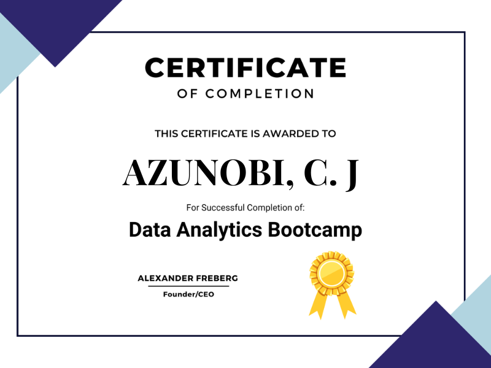
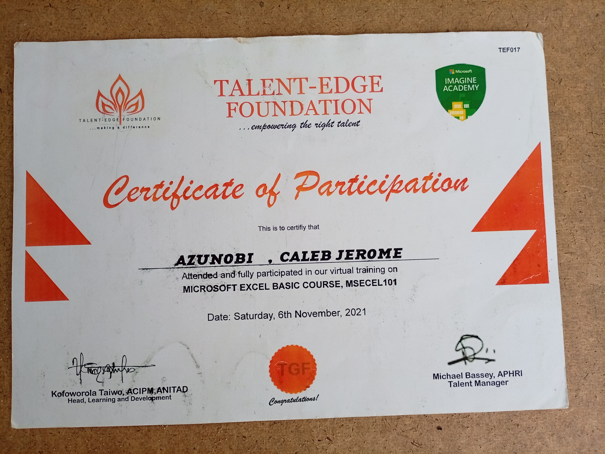
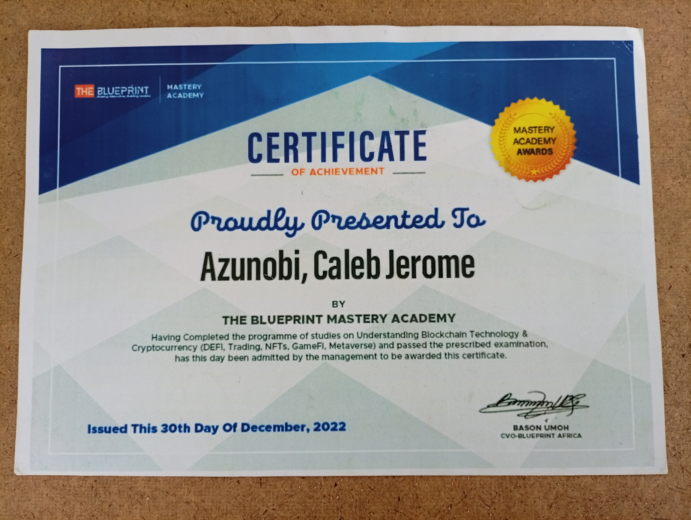
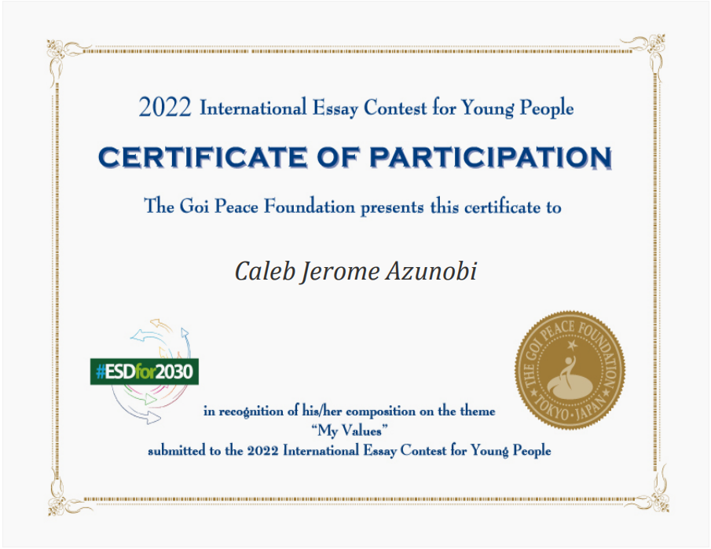

# 📜 Certifications Portfolio

Welcome to my **Certifications Archive** — a curated collection of professional certifications that validate my skills, continuous learning mindset, and commitment to excellence in technology.

Each certificate represents a milestone in my journey as a **Full-Stack Developer, AI Enthusiast, and Tech Innovator**.

---

## 🎯 Purpose of This Repository

This folder serves as:

- 📂 A **centralized repository** for all my certifications  
- 🧾 A **verifiable proof** of my technical competencies  
- 🚀 A reflection of my **commitment to continuous learning**  

---

## 📊 Certifications Overview

| Certification | Issuer | Focus Area |
|--------------|--------|------------|
| Data Analytics Bootcamp | Alex The Analyst | Data Analysis |
| Microsoft Excel Course | Talent Edge Foundation | Data Handling |
| NFT Certification | Blueprint Mastery Academy | Blockchain |
| Goi Peace Certification | Goi Peace Foundation | Peace Prize |

---

## 📜 Certificates

### 📊 Data Analytics Bootcamp  
**Issuer:** Alex The Analyst  

---

### 📈 Microsoft Excel Certification  
**Issuer:** Talent Edge Foundation  

---

### ⛓ NFT Certification  
**Issuer:** Blueprint Mastery Academy  

---

### ⛓ Goi Peace Certification
**Issuer:** Goi Peace Foundation 

---

## 🧠 Skills Validated

These certifications reinforce my capabilities in:

- 📊 Data Analysis & Interpretation  
- 📈 Spreadsheet Modeling & Business Insights  
- ⛓ Blockchain Fundamentals & NFT Ecosystems  
- 🧠 Analytical Thinking & Problem Solving  

---

## 🔥 Continuous Learning Philosophy

In the ever-evolving tech ecosystem, staying static is not an option.

I actively invest in:

- Learning emerging technologies (AI, Blockchain, Data Science)  
- Strengthening foundational knowledge  
- Applying theoretical knowledge to real-world projects  

---

## 🚀 What’s Next?

I am currently expanding into:

- 🤖 Artificial Intelligence & Machine Learning  
- 🧠 Advanced Data Systems  
- ⚙️ Scalable Backend Architectures  

---

## 📌 Note

All certificates are stored as images in this directory.  
For verification or collaboration opportunities, feel free to reach out.

---

## 🤝 Let’s Connect

If you're looking for someone who combines **certified knowledge + real-world execution**, let’s build something impactful together.
